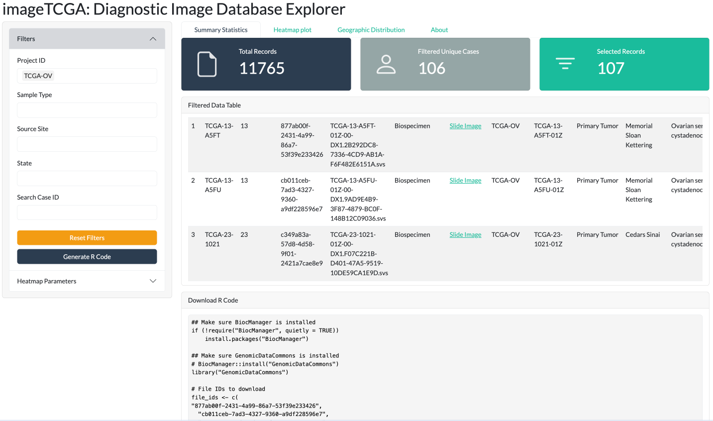
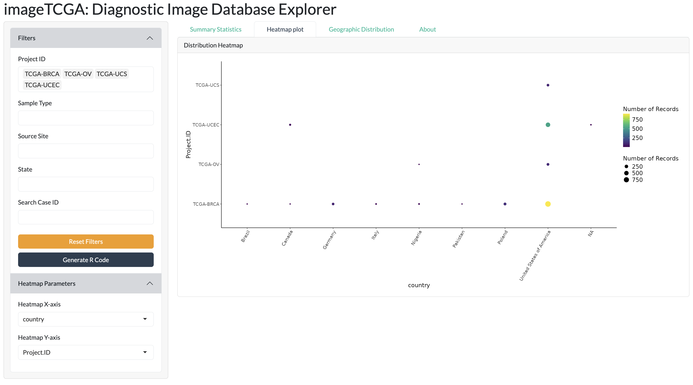

# imageTCGA

`imageTCGA` is an R package designed to provide an interactive Shiny 
application for exploring the TCGA Diagnostic Image Database. 
This application allows users to filter and visualize metadata, 
geographic distribution, and other relevant statistics 
related to TCGA diagnostic images.

This package is part of the Multi-omic Integration of Histopathology 
Image Analysis working group, which addresses the need for
standardized workflows to integrate histopathology image-derived 
features with genomic and transcriptomic analyses in R/Bioconductor. 
`imageTCGA` lays the foundation for a comprehensive platform where
pre-extracted image features from Python-based tools from TCGA 
will be made accessible within R/Bioconductor data structures, 
streamlining data integration and accelerating research in 
computational pathology and precision oncology.


# Installation

```{r,eval=FALSE}
if (!requireNamespace("BiocManager", quietly = TRUE))
    install.packages("BiocManager")

BiocManager::install("imageTCGA")
```

## Setup

Load the package:

```{r, include=TRUE, results="hide", message=FALSE, warning=FALSE}
library(imageTCGA)
```

## Run the shiny App

After installing the package, you can run the Shiny application
by executing the following command in R:

```{r,eval=FALSE}
imageTCGA::imageTCGA()
```

This will open the application in your default web browser,
where you can explore 11,765 diagnostic images from 9,640 patients, 
filtering them based on various clinical and pathological parameters.

```{r,echo=FALSE}

```

# Filtering

The application allows filtering by any of the available columns in the dataset.
For instance, you can filter for a specific tumor type, 
such as Ovarian Cancer (107 diagnostic images).


```{r,echo=FALSE}

```


# R Code 

You can generate R code to download the selected images to your
local machine by clicking the orange "Generate R Code" button. 
This utilizes the GenomicDataCommons package.

In the example below, Ovarian Cancer images from Memorial Sloan
Kettering Hospital have been selected:

```{r,echo=FALSE}

```

# Visulization 

## Dotplot 

The dot plot visualization allows users to explore gynecological tumors 
(BRCA, OV, UCS, UCEC). On the left panel, 
you can select which variables to plot on the x-axis and y-axis.

```{r,echo=FALSE}

```

## Geographic Distribution

The application provides an interactive geographic visualization, 
displaying the origin of diagnostic images at
the center, country, and state level.

For example, in the image below, GBM tumors have been selected.
Additionally, summary statistics such as the number of cities and
states are reported alongside a bar plot of the state distribution.

```{r,echo=FALSE}

```

# Session Info

```{r}
sessionInfo()
```
